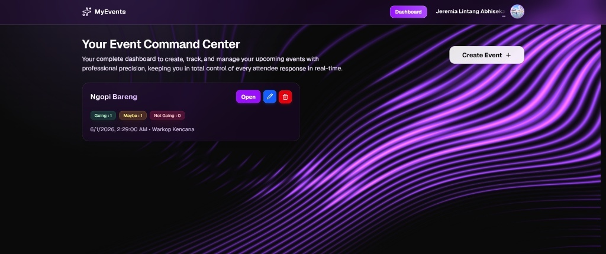
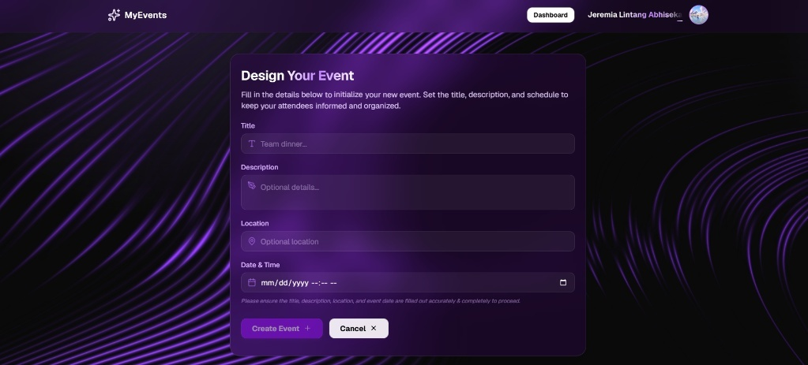
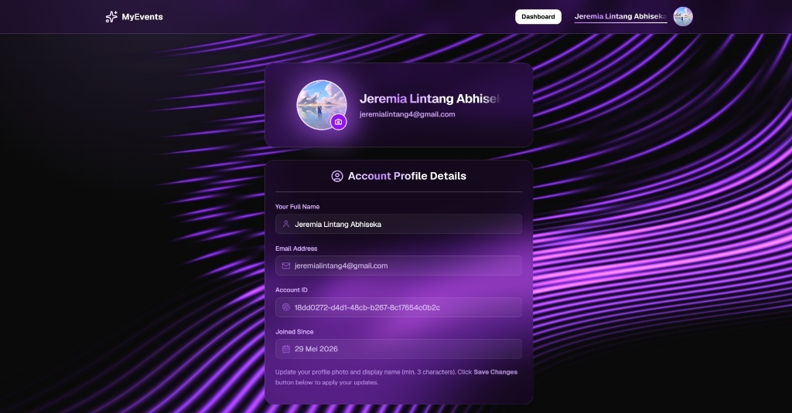
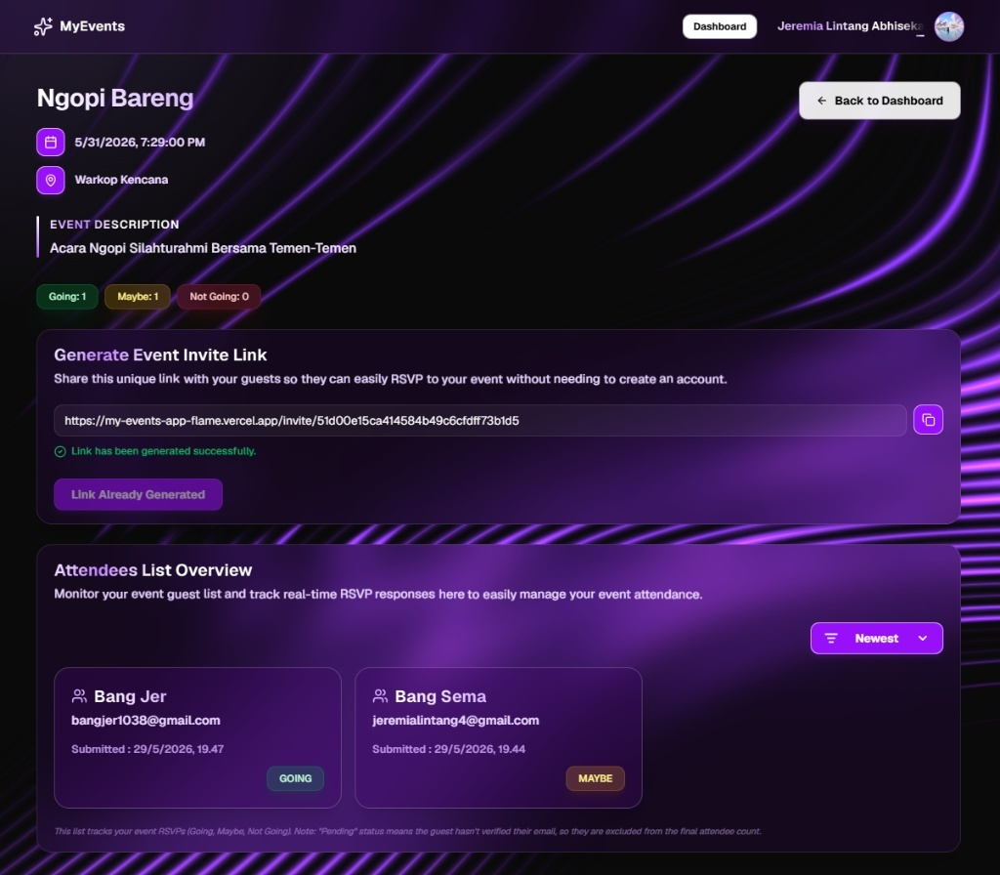

# Event Planner App

MyEvents adalah platform manajemen acara berbasis web yang dirancang untuk menyederhanakan alur kerja penyelenggara dalam mengelola undangan dan tamu. Aplikasi ini menyediakan sistem RSVP yang efisien, memungkinkan penyelenggara untuk memantau status kehadiran secara real-time, serta memfasilitasi koordinasi tamu dengan fitur manajemen data yang terstruktur. Dibangun dengan fokus pada kemudahan penggunaan, aplikasi ini membantu memastikan setiap detail acara berjalan lancar dari tahap persiapan hingga hari pelaksanaan.

## 🚀 Akses Aplikasi
Anda dapat mencoba dan mengakses aplikasi **MyEvents** secara langsung melalui tautan *live demo* yang disediakan di bawah ini. Aplikasi ini di-*deploy* secara otomatis untuk memastikan Anda selalu mendapatkan fitur terbaru.

### 🌐 Live Web Application
Anda dapat mengakses versi web aplikasi di sini:
- **Link Demo:** [MyEvents App Live Demo](https://my-events-app-flame.vercel.app/)
- **Status:** *Production* (Aktif)
- **Teknologi:** Dibangun dengan Next.js dan di-*deploy* menggunakan Vercel untuk performa yang optimal.

### 💡 Panduan Penggunaan
1. **Akses:** Klik tautan di atas untuk membuka aplikasi di *browser* (direkomendasikan menggunakan Google Chrome atau Microsoft Edge versi terbaru).
2. **Eksplorasi:** Anda dapat mencoba fitur utama seperti RSVP dan manajemen koordinasi tamu secara langsung.
3. **Umpan Balik:** Jika Anda menemukan kendala teknis atau memiliki saran pengembangan, silakan buka *issue* di repositori ini.
---
> **Catatan:** Jika Anda merasa waktu muat (*loading*) terasa sedikit lama saat pertama kali dibuka, mohon tunggu sebentar karena aplikasi sedang melakukan inisialisasi pada *serverless function* di sisi Vercel.

## 🛠️ Teknologi Utama
Aplikasi ini dibangun menggunakan *stack* teknologi modern untuk memastikan performa yang cepat, skalabilitas yang baik, dan pengalaman pengguna yang responsif :
- **Framework:** [Next.js 15](https://nextjs.org/) (App Router) – Menggunakan fitur *server-side rendering* terbaru untuk performa yang optimal dan SEO yang lebih baik.
- **Database:** [PostgreSQL (Neon)](https://neon.tech/) & [Prisma ORM](https://www.prisma.io/) – Menggunakan basis data relasional yang *serverless* dengan Prisma ORM untuk manajemen skema database yang aman dan efisien.
- **Styling:** [Tailwind CSS](https://tailwindcss.com/) – *Utility-first framework* yang digunakan untuk membangun antarmuka pengguna yang modern, konsisten, dan sepenuhnya responsif.
- **Authentication:** [JWT (JSON Web Token)](https://jwt.io/) – Sistem autentikasi berbasis *token* untuk mengelola sesi pengguna dengan aman.
- **Storage:** [UploadThing](https://uploadthing.com/) – Solusi *file storage* yang efisien untuk menangani unggahan media dan aset gambar secara *seamless*.
- **State Management:** [Zustand](https://zustand-demo.pmnd.rs/) – *Library* manajemen *state* yang ringan dan cepat untuk menangani data aplikasi dengan kompleksitas rendah namun performa tinggi.

## 📋 Fitur Utama
Aplikasi ini dilengkapi dengan fitur-fitur esensial untuk mendukung manajemen acara yang modern :
- **Pembuatan Event Dinamis:** Memungkinkan penyelenggara untuk membuat, mengedit, dan mengelola detail acara (seperti lokasi, waktu, dan informasi tambahan) secara *real-time*.
- **Sistem Undangan Eksklusif:** Menggunakan mekanisme token unik untuk setiap tamu, memastikan akses yang aman dan meminimalisir penyebaran undangan yang tidak sah.
- **RSVP Tamu Terintegrasi:** Sistem konfirmasi kehadiran yang terhubung langsung dengan verifikasi email, memberikan akurasi data kehadiran yang tinggi.
- **Dashboard Manajemen Intuitif:** Antarmuka khusus penyelenggara untuk memantau status kehadiran tamu, melakukan analisis data acara, serta mengelola daftar tamu dengan efisien.

## 🏗️ Arsitektur & Pola Desain
Aplikasi ini dikembangkan dengan pendekatan arsitektur modern untuk memastikan performa yang cepat dan kemudahan pemeliharaan kode :
- **Server-Centric Development:** Memanfaatkan **Next.js Server Actions** untuk menangani logika bisnis secara langsung di sisi *server*, sehingga mengurangi beban *client* dan mempercepat waktu respons aplikasi.
- **Modular Design:** Struktur kode dirancang dengan pendekatan modular, memisahkan logika antarmuka, akses data, dan *business logic* untuk memudahkan pengembangan dan *debugging*.
- **Prinsip Clean Code:** Menerapkan prinsip **DRY** (*Don't Repeat Yourself*) dan **SOLID** dalam penulisan kode untuk memastikan seluruh sistem bersifat *scalable*, fleksibel terhadap perubahan, dan mudah dipahami oleh pengembang lain.
- **Optimized Data Flow:** Menggunakan aliran data yang efisien antara komponen UI dan *database*, didukung oleh *caching* yang cerdas untuk memastikan pengalaman pengguna yang tetap mulus meski dengan trafik yang tinggi.

## ⚙️ Setup Lokal
Untuk menjalankan aplikasi ini di lingkungan lokal Anda, ikuti langkah-langkah detail berikut :
### 1. Persiapan Awal
Pastikan komputer Anda telah terinstal software berikut:
- **Node.js** (Versi 18 atau lebih baru sangat disarankan)
- **Git** (Untuk melakukan cloning repositori)
- **Package Manager** (npm, yarn, atau pnpm)
### 2. Clone Repositori
Lakukan clone proyek ke direktori lokal Anda melalui terminal:
```bash
git clone [https://github.com/M0R4Xxx/My-Events-App.git](https://github.com/M0R4Xxx/My-Events-App.git)
cd My-Events-App
```

| Halaman | Screenshot |
| :--- | :--- |
| **Landing Page** |  |
| **Dashboard** |  |
| **Create Event** |  |
| **Account Profile** |  |
| **Event Detail** |  |
| **RSVP Form** |  |
| **Undangan User** |  |


